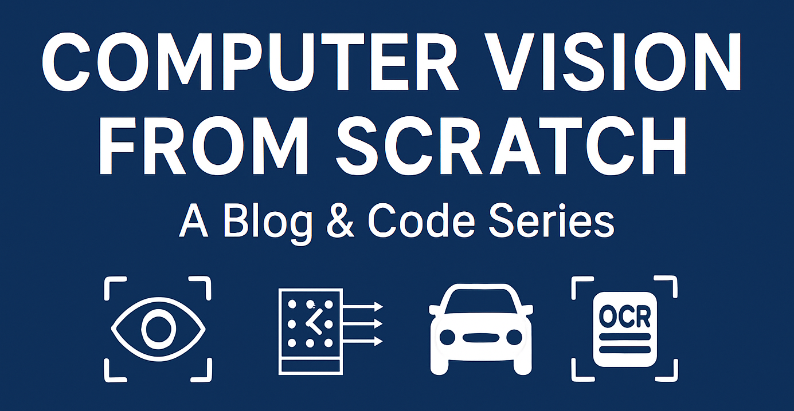

  

# Computer Vision From Scratch – A Blog & Code Series

Welcome! This is an open learning journey where I explore **Computer Vision** from the ground up by writing blog posts and code tutorials.  
Each post focuses on a key concept, includes real-world applications, and is paired with code (Colab notebooks or scripts).

---

## 🧭 What You'll Find Here

- 📖 Weekly blog posts (`/posts`)
- 💻 Hands-on code & notebooks (`/notebooks`)
- 🖼️ Supporting images & diagrams (`/assets`)
- 🎯 Real-world use cases & explanations

---

## 📚 Blog Series Overview

| Week | Topic | Notebook |
|------|-------------------------------|----------|
| ✅ 1 | [What is Computer Vision?](posts/01-what-is-cv.md) | [Colab](notebooks/01-what-is-cv.ipynb) |
| ⏳ 2 | Pixels, Colors, and Formats | Coming soon |
| ⏳ 3 | Image Processing with OpenCV | Coming soon |
| ⏳ 4 | Image Classification Basics | Coming soon |

---

## 🛠 Tech Stack

- Python
- OpenCV
- NumPy
- Matplotlib
- Google Colab / Jupyter

---

## 💡 Why I'm Building This

- Solidify my own understanding by teaching it
- Share free resources for other learners
- Build a strong, visible portfolio for work opportunities

---

## 🤝 Feedback & Contributions

Got suggestions, spotted a bug, or want to chat?  
Feel free to:
- 📩 **Email me at** [rahmatheroza@gmail.com](mailto:rahmatheroza@gmail.com)
- 💬 **DM me on LinkedIn:** [Rahmat Izwan Heroza](https://www.linkedin.com/in/heroza)

---

_Thanks for stopping by_
